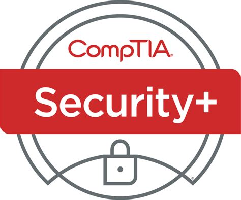

# Certificazione CompTIA Security+ (Exam SY0-601)

Di seguito riporto la lista degli obiettivi con i relativi argomenti del percorso di studio per l'ottenimento della certificazione CompTIA Security+ (SY0-601). Può essere utilizzato anche come base di partenza per coloro che si avvicinano al mondo della Cybersecurity e vogliono avere un punto di partenza sugli argomenti da studiare per poi approfondire.

* Esame richiesto: **SY0-601**
* Numero di domande: **90**
* Tipo di domande: **A scelta multipla e basate sulla migliore** (_performance-based_)
* Durata: **90 minuti+30** (_per coloro che non sono madre lingua inglese_)
* Punteggio minimo per il superamento: **750** (su una scala da 100-900)

## Obiettivi d'esame (domini)

| **Dominio** | **% di domande** |
| :--- | :---: |
| 1.0 Attacks, Threats and vulnerability | 24% |
| 2.0 Architecture and Design | 21% |
| 3.0 Implementation | 25% |
| 4.0 Operations and Incident Response | 16% |
| 5.0 Governance, Risk, and Compliance | 14% |
| Totale | 100% |

## 1.0 Attacks, Threats and vulnerability

### 1.1 Compare and contrast different types of social engineering techniques

* Phishing
* Smishing
* Vishing
* Spam
* Spam over Instant Messaging (SPIM)
* Spear phishing
* Dumpster diving
* Shoulder surfing
* Pharming
* Tailgating
* Eliciting information (Sollecitare informazioni)
* Whaling
* Prepending
* Identity fraud
* Invoice scams
* Credential harvesting
* Reconnaissance
* Hoax
* Impersonation
* Watering hole attack
* Typosquatting
* Pretexting
* Influence campaigns
  * Hybrid warfare
  * Social media
* Principies (reasons for effectiveness)
  * Authority
  * Intimidation
  * Consensus
  * Scarcity
  * Familiarity
  * Trust
  * Urgency

### 1.2 Given a scenario, analyze potential indicators to determine the type of attack

* Malware
  * Ransomware
  * Trojans
  * Worms
  * Potentially unwanted programs (PUPs)
  * Fileless virus
  * Command and control
  * Bots
  * Cryptomalware
  * Logic bombs
  * Spyware
  * Keyloggers
  * Remote access Trojan (RAT)
  * Rootkit
  * Backdoor
* Password attacks
  * Spraying
  * Dictionary
  * Brute force
    * Offline
    * Online
  * Rainbow table
  * Plaintext/unencrypted
* Physical attaks
  * Malicious Universal
  * Serial Bus (USB) cable
  * Malicious flash drive
  * Card cloning
  * Skimming
* Adversarial artificial Intelligence (AI)
  * Tainted training data for machine learning (ML)
  * Security of machine learning algorithms
* Supply chain attacks
* Cloud-based vs. on-premises attacks
* Cryptographic attacks
  * Birthday
  * Collision
  * Downgrade

### 1.3 Given a scenario, analyze potential indicators associated with application attacks

* Privilege escalation
* Cross-site scripting
* Injections
  * Structured query language (SQL)
  * Dynamic-link library (DLL)
  * Lightweight Directory
  * Access Protocol (LDAP)
  * Extensible Markup Language (XML)
* Pointer/object dereference
* Directory traversal
* Buffer overflows
* Race conditions
  * Time of check/time of use
* Error handling
* Improper input handling
* Replay attack
  * Session replays
* Integer overflow
* Request forgeries
  * Server-side
  * Cross-site
* Application programming interface (API) attacks
* Resource exhaustion
* Memory leak
* Secure Sockets Layer (SSL stripping)
* Driver manipulation
  * Shimming
  * Refactoring
* Pass the hash

### 1.4 Given a scenario, analyze potential indicators associated with network attacks

* Wireless
  * Evil twin
  * Rogue access point
  * Bluesnarfing
  * Bluejacking
  * Disassociation
  * Jamming
  * Radio frequency identification (RFID)
  * Near-field communication (NFC)
  * Initialization vector (IV)
* On-path attack (ex _man-in-the-middle attack/man-in-the-browser attack_)
* Layer 2 attacks
  * Address resolution
  * Protocol (ARP) poisoning
  * Media access control (MAC) flooding
  * MAC cloning
* Domain name system (DNS)
  * Domain hijacking
  * DNS poisoning
  * Uniform Resource
  * Locator (URL) redirection
  * Domain reputation
* Distributed denial-of-service (DDoS)
  * Network
  * Application
  * Operational technology (OT)
* Malicious code or script execution
  * PowerShell
  * Python
  * Bash
  * Macros
  * Visual Basic Applications (VBA)

### 1.5 Explain different threat actors, vectors, and intelligence sources

* Actors and threats
  * Advanced persistent threat (ATP)
  * Insider threats
  * State actors
  * Hacktivists
  * Script kiddies
  * Criminal syndicates
  * Hackers
    * Authorized
    * Unauthorized
    * Semi-authorized
  * Shadow IT
  * Competitors
  * Attributes of actors
    * Internal/external
    * Level of sophistication/capability
    * Resources/funding
    * Intent/motivation
  * Vectors
    * Direct access
    * Wireless
    * Email
    * Supply chain
    * Social media
    * Removable media
    * Cloud
  * Threat intelligence sources
    * Open-source intelligence (OSINT)
    * Closed/proprietary
    * Vulnerability databases
    * Public/private information-sharing centers
    * Dark web
    * Indicators of compromise
    * Automated Indicator Sharing (AIS)
    * Structured Threat Information eXpression (STIX)/Trusted Automated eXchange of Intelligence Information (TAXII)
    * Predictive analysis
    * Threat maps
    * File/code repositories
  * Research sources
    * Vendor websites
    * Vulnerability feeds
    * Conferences
    * Academic journals
    * Request for comments (RFC)
    * Local industry groups
    * Social media
    * Threat feeds
    * Adversary tactics, techniques, and procedures (TTP)

### 1.6 Explain the security concerns associated with various types of vulnerabilities

* Cloud-based vs. on premises vulnerabilities
* Zero-day
* Weak configurations
  * Open permissions
  * Unsecure root accounts
  * Errors
  * Weak encryption
  * Unsecure protocols
  * Default settings
  * Open port and services
* Third-party risks
  * Vendor management
    * System integration
    * Lack of vendor support
  * Supply chain
  * Outsourced code development
  * Data storage
* Improper or weak patch management
  * Firmware
  * Operating system (OS)
  * Applications
* Legacy platforms
* Impacts
  * Data loss
  * Data breaches
  * Data exfiltration
  * Identity theft
  * Financial
  * Reputation
  * Availability loss

### 1.7 Summarize the techniques used in security assesments

* Threat hunting
  * Intelligence fusion
  * Threat feeds
  * Advisories and bulletins
  * Maneuver
* Vulnerability scans
  * False positives
  * False negatives
  * Log reviews
  * Credentialed vs. non-credentialed
  * Intrusive vs. non-intrusive
  * Application
  * Web application
  * Network
  * Common Vulnerabilities and Exposures (CVE)/Common Vulnerability Scoring System (CVSS)
  * Configuration review
* Syslog/Security information and event management (SIEM)
  * Review reports
  * Packet capture
  * Data inputs
  * User behavior analysis
  * Sentiment analysis
  * Security monitoring
  * Log aggregation
  * Log collectors
* Security orchestration, automation, and response (SOAR)

### 1.8 Explain the techniques used in penetration testing

* Penetration testing
  * Known environment
  * Unknown environment
  * Partially known environment
  * Rules of engagement
  * Lateral movement
  * Privilege escalation
  * Persistence
  * Cleanup
  * Bug bounty
  * Pivoting
* Passive and active reconnaissance
  * Drones
  * War flying
  * War driving
  * Footprinting
  * OSINT
* Exercise types
  * Red-team
  * Blue-team
  * White-team
  * Purple-team

## 2.0 Architecture and Design

### 2.1 Explain the importance of security concepts in an enterprise environment

* Configuration management
  * Diagrams
  * Baseline configuration
  * Standard naming conventions
  * Internet protocol (IP) schema
* Data sovereignty
* Data protection
  * Data loss prevention (DLP)
  * Masking
  * Encryption
  * At rest
  * In transit/motion
  * In processing
  * Tokenization
  * Rights management
* Geographical considerations
* Response and recovery controls
* Secure Sockets Layer (SSL)/Transport Layer Security (TLS) inspection
* Hashing
* API considerations
* Site resiliency
  * Hot site
  * Cold site
  * Warm site
* Deception and disruption
  * Honeypots
  * Honeyfiles
  * Honeynets
  * Fake telemetry
  * DNS sinkhole

### 2.2 Summarize virtualization and cloud computing concepets

* Cloud models
  * Infrastructure as service (IaaS)
  * Platform as service (PaaS)
  * Software as service (SaaS)
  * Anything as service (XaaS)
  * Public
  * Community
  * Private
  * Hybrid
* Cloud service providers
* Managed service provides (MSP)/Managed security service provider (MSSP)
* On-premises vs. off-premises
* Fog computing
* Edge computing
* Thin client
* Containers
* Microservices/API
* Infrastructure as code
  * Software-defined networking (SDN)
  * Software-defined visibilty (SDV)
* Serverless architecture
* Services integration
* Resource policies
* Transit gateway
* Virtualization
  * Virtual machine (VM) sprawl avoidance
  * WM escape protection

### 2.3 Summarize secure application development, deployment and automation concepts

* Environment
  * Development
  * Test
  * Staging
  * Production
  * Quality assurance (QA)
* Provisioning and deprovisioning
* Integrity measurement
* Secure coding techniques
  * Normalization
  * Stored procedures
  * Obfuscation/camouflage
  * Code reuse/dead code
  * Server-side vs. client-side execution and validation
  * Memory management
  * Use of third-party libraries and software development kits (SDKs)
  * Data exposure
* Open Web Application Security Project (OWASP)
* Software diversity
  * Compiler
  * Binary
* Automation/scripting
  * Automated courses of action
  * Continous monitoring
  * Continous validation
  * Continous integration
  * Continous delivery
  * Continous deployment
* Elasticity
* Scalability
* Version control

### 2.4 Summarize authentication and authorization design concepts

* Authentication methods
  * Directory services
  * Federation
  * Attestation
  * Technologies
    * Time-based one-time password (TOTP)
    * HMAC-based one-time password (HOTP)
    * Short message service (SMS)
    * Token key
    * Static codes
    * Authentication applications
    * Push notifications
    * Phone call
  * Smart card authentication
* Biometrics
  * Fingerprint
  * Retina
  * Iris
  * Facial
  * Voice
  * Vein
  * Gait analysis
  * Efficacy rates
  * False acceptance
  * False rejection
  * Crossover error rate
* Multifactor authentication (MFA) factors and attributes
  * Factors
    * Something you know
    * Something you have
    * Something you are
  * Attributes
    * Somewhere you are
    * Something you can do
    * Something you exhibit
    * Someone you know
* Authentication, authorization and accounting (AAA)
* Cloud vs. on-premises requirements

### 2.5 Given a scenario, implement cybersecurity resilience

* Redundancy
  * Geographic dispersal
  * Disk
    * Redundant array of inexpensive disks (RAID) levels
    * Multipath
  * Network
    * Load balancers
    * Network interface card (NIC) teaming
  * Power
    * Uninterruptible power supply (UPS)
    * Generator
    * Dual supply
    * Managed power distribution units (PDUs)
* Replication
  * Storage area network
  * VM
* On-premises vs. cloud
* Backup types
  * Full
  * Incremental
  * Snapshot
  * Differential
  * Tape
  * Disk
  * Copy
  * Network-attached storage (NAS)
  * Storage area network
  * Cloud
  * Image
  * Online vs. offline
  * Offsite storage
    * Distance consideration
* Non-persistence
  * Revert to known state
  * Last known-good configuration
  * Live boot media
* High availability
  * Scalability
* Restoration order
* Diversity
  * Technologies
  * Vendors
  * Crypto
  * Controls

### 2.6 Explain the security implications of embedded and specialized systems

* Embedded systems
  * Raspberry Pi
  * Field-programmable gate-array (FPGA)
  * Arduino
* Supervisory control and data acquisition (SCADA)/industrial control system (ICS)
  * Facilities
  * Industrial
  * Manufacturing
  * Energy
  * Logistics
* Internet of Things (IoT)
  * Sensors
  * Smart devices
  * Wearables
  * Facility automation
  * Weak defaults
* Specialized
  * Medical systems
  * Vehicles
  * Aircraft
  * Smart meters
* Voice over IP (VoIP)
* Heating, ventilation, air conditioning (HVAC)
* Drones
* Multifunction printer (MFP)
* Real-time operating system (RTOS)
* Surveillance systems
* System on chip (SoC)
* Communication considerations
  * 5G
  * Narrow-band
  * Baseband radio
  * Subscriber identity module (SIM) cards
  * Zigbee
* Constraints
  * Power
  * Compute
  * Network
  * Crypto
  * Inability to path
  * Authentication
  * Range
  * Cost
  * Implied trust

### 2.7 Explain the importance of physical security controls

* Bollards/barricades
* Access control vestibules
* Badges
* Alarms
* Signage
* Cameras
  * Motion recognition
  * Object detection
* Closed-circuit television (CCTV)
* Industrial camouflage
* Personnel
  * Guards
  * Robot sentries
  * Reception
  * Two-person integrity/control
* Locks
  * Biometrics
  * Electronic
  * Physical
  * Cable locks
* USB data blocker
* Lighting
* Fencing
* Fire suppression
* Sensors
  * Motion detection
  * Noise detection
  * Proximity reader
  * Moisture detection
  * Cards
  * Temperature
* Drones
* Visitor logs
* Faraday cages
* Air gap
* Screened subnet (previously known as demilitarized zone)
* Protected cable distribution
* Secure areas
  * Air gap
  * Vault
  * Safe
  * Hot aisle
  * Cold aisle
* Secure data destruction
  * Burning
  * Shredding
  * Pulping
  * Pulverizing
  * Degaussing
  * Third-party solutions

### 2.8 Summarize the basics of cryptographic concepts

* Digital signatures
* Key length
* Key stretching
* Salting
* Hashing
* Key exchange
* Elliptic-curve cryptography
* Perfect forward secrecy
* Quantum
  * Communications
  * Computing
* Post-quantum
* Ephemeral
* Modes of operation
  * Authenticated
  * Unauthenticated
  * Counter
* Blockchain
  * Public ledgers
* Cipher suites
  * Stream
  * Block
* Symmetric vs. asymmetric
* Lightweight cryptography
* Steganography
  * Audio
  * Video
  * Image
* Homomorphic encryption
* Common use cases
  * Low power devices
  * Low latency
  * High resiliency
  * Supporting confidentiality
  * Supporting integrity
  * Supporting obfuscation
  * Supporting authentication
  * Supporting non-repudation
* Limitations
  * Speed
  * Size
  * Weak Keys
  * Time
  * Longevity
  * Predictability
  * Reuse
  * Entropy
  * Computational overheads
  * Resource vs. security constraints

## 3.0 Implementation
